# Room Buzzer
Welcome to my hardware project, the Room Buzzer! This is the journal where I will be writing all my Devlogs, and where you can see how the project grew!

# Devlog 1
2h 0min 19sec Logged

I started the Room Buzzer today! I actually made really good progress in the very first CAD session. I would have paused in the middle to make two one-hour devlogs, but I was too locked in. I got the whole CAD done, and at the time that I am writing this devlog, the case and its face are being printed on my 3D printer! I didn't just CAD the printed parts, though. I also modeled the entire perfboard! Well, everything save the connections and the resistors. I found all their models online or in my library of common electronic parts' STEP files, and I fiddled around with their placement on a 6cm x 4cm perfboard until I got something I liked. I then modeled the entire case around it, just for the Micro USB to be too high on the side! I had to flip the ESP-32 onto the opposite side of the perfboard from everything else and practically start the case from scratch. Still, I'm happy with the end result. I'll be soldering the perfboard together tomorrow, and it'll be my first time doing that, so I'm very excited!

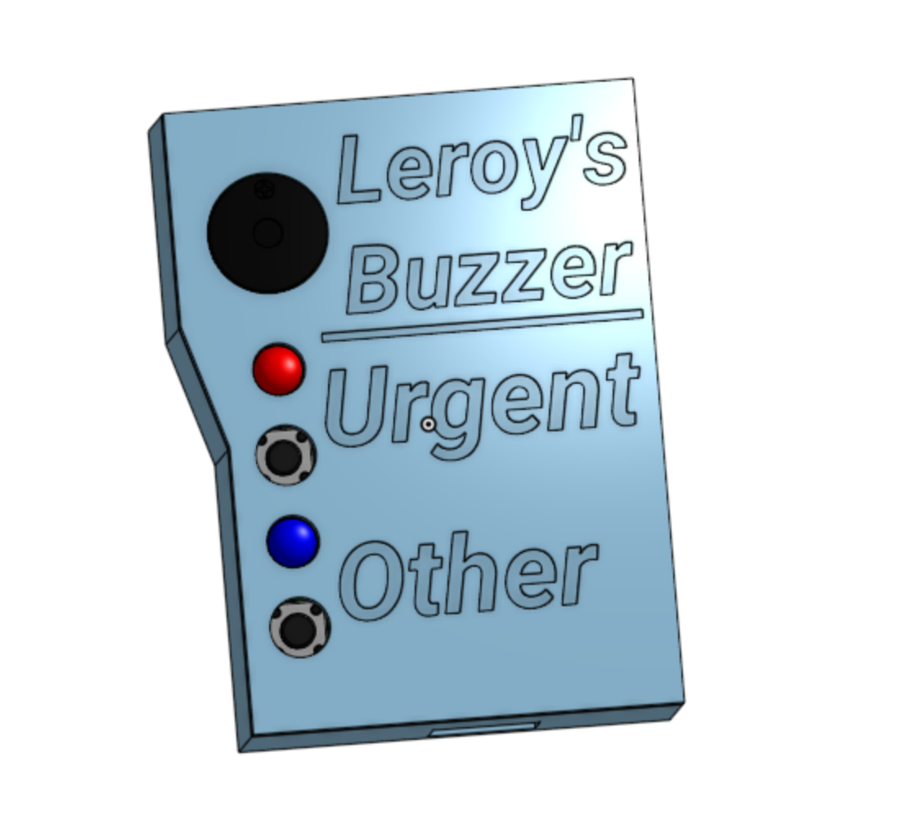
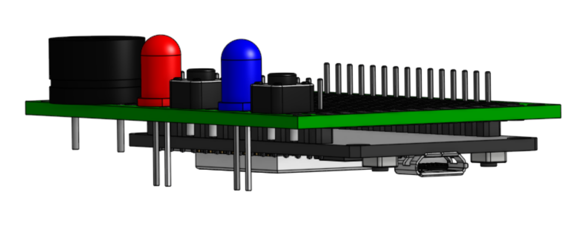

# Devlog 2
1h 28min 0sec Logged

I started building the Room Buzzer today. I successfully soldered the whole perfboard together. It was the first time that I had done that, and it was really fun! It was pretty successful, too. I haven't tested it yet, but all the connections seem solid. Trouble came when I tried putting the perfboard into the case. Not only was the case poorly printed, the Micro USB port's hole was off as well. The cover was not much better, with the buzzer's hole being too low and the buttons' holes being too small. I'll have to fix all that now...

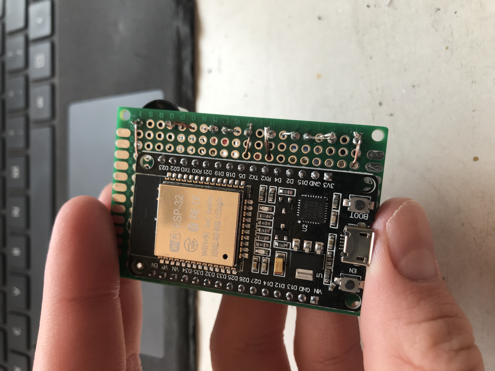

# Devlog 3
1h 14min 9sec Logged

I finished the transmitter module of the Room Buzzer! I printed a new case and cover, and they both fit properly this time. I slapped a 9V battery-to-USB converter on the back, and it worked well. I even took a few pictures! Still, I want to use a different power source, which I'll be CADing a case for soon. The firmware was easier than I expected, as the button pressing, LED flashing, and buzzer buzzing were all the same as I had done before. What was different was using my home WiFi and Windows Powershell on my laptop to get notifications from the transmitter. Still, I want to be able to run this system without my laptop, and even without WiFi, so I'll be making a receiver module next, and updating the firmware to use ESP-NOW, which will be able to run locally. 

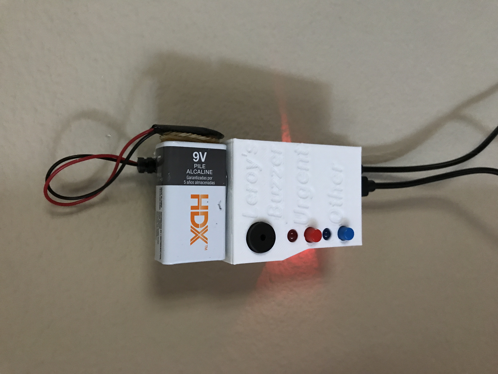
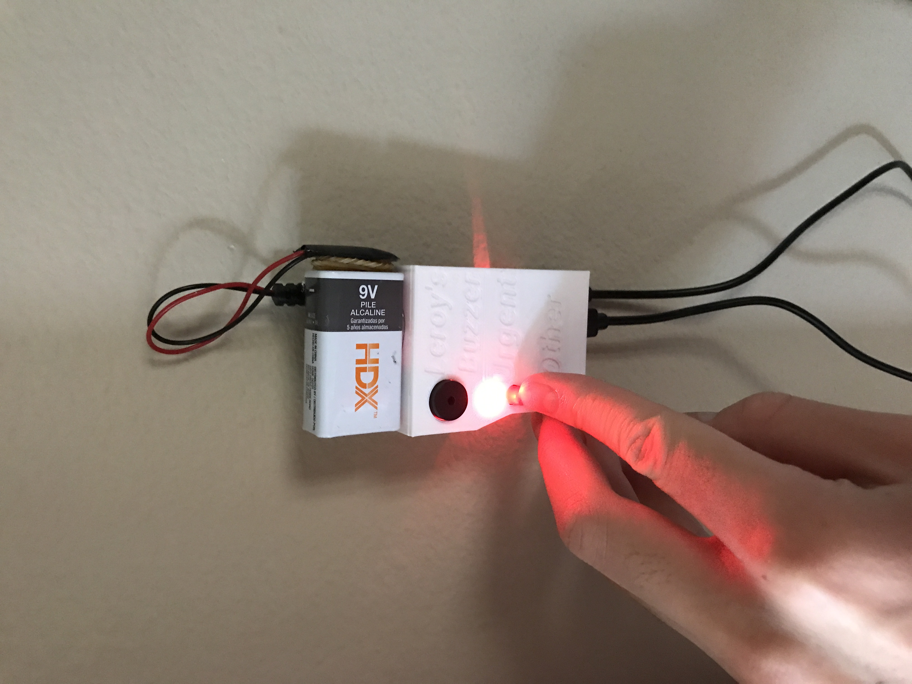
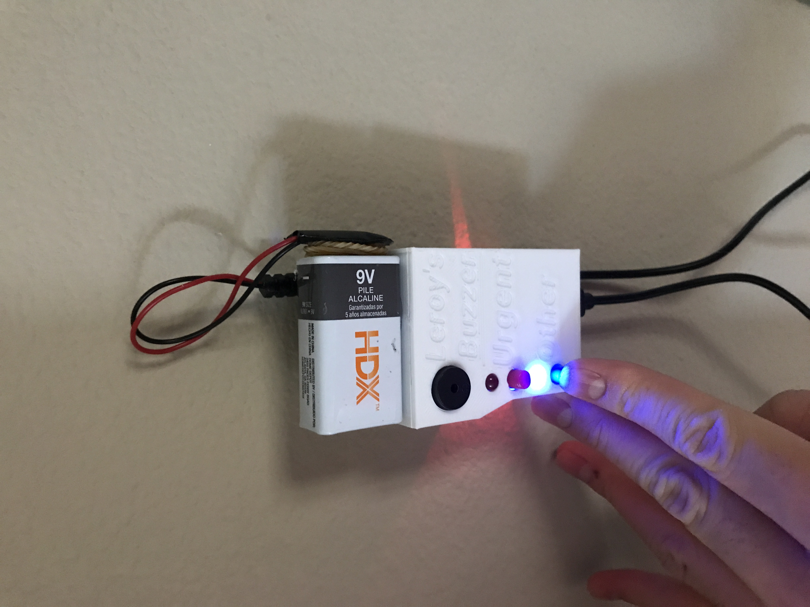

# Devlog 4
1h 27min 0sec Logged

I CADed both the power module and the receiver module. I decided to avoid using a perfboard in my receiver module, as I only have one left and I want to be able to reuse this ESP-32 in the future. That meant that this receiver module has to be a lot larger than the transmitter module. Still, it should work alright. The power module was simple: an Elegoo Power MB V2 holster and a 9V battery holster in one. I'll set it up inside my room, run the wire through the crack in the door, and have the buzzer be outside my door. 

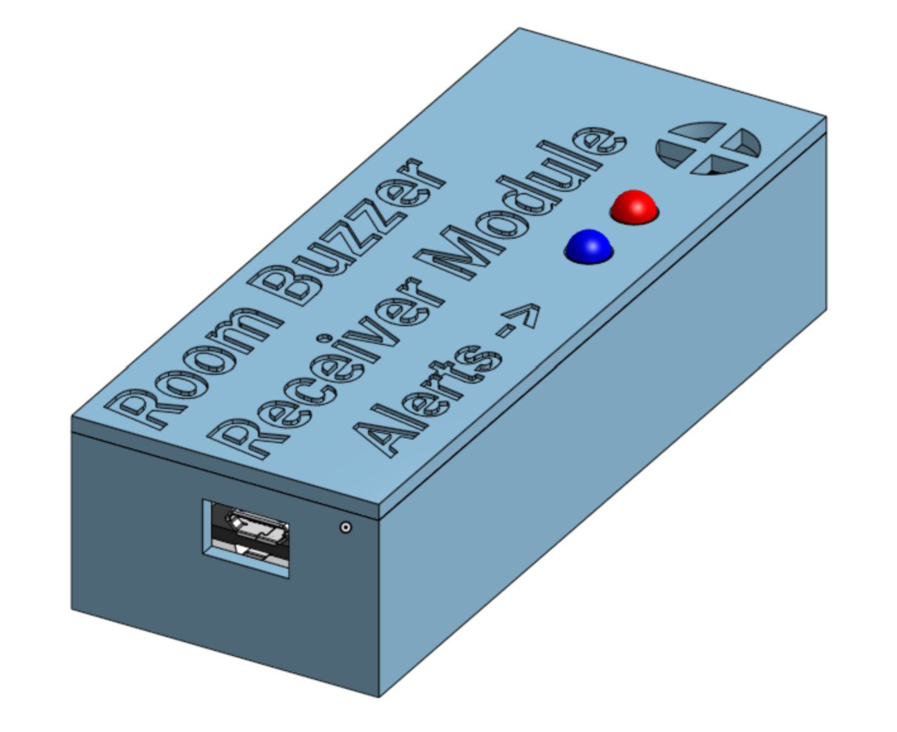
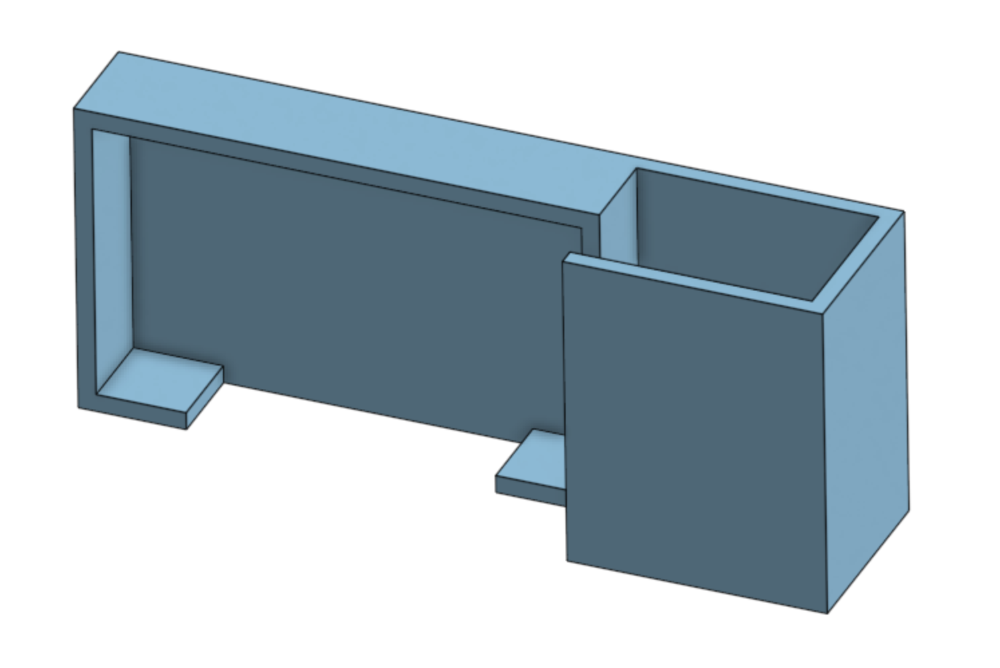

# Devlog 5
1h 13min 0sec Logged

I CADed a model of the Elegoo Power MB V2 for my Power Module assembly. I will do the same for the resistors and wires on the perfboard next. Though I wanted to make a receiver module, it seems that I will no longer be able to, as my 3D printer's extruder broke this morning. The replacement will not arrive in time for the Horizons program. I will be forced to content myself with laptop notifications. 

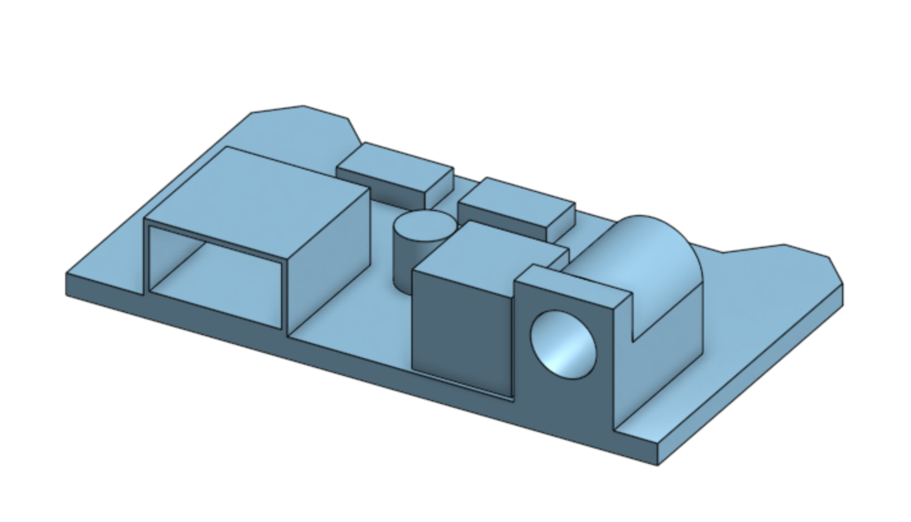

# Devlog 6
1h 30min 0sec Logged

I started CADing all the wire connections on the perfboard. It was sorta my first time using the Revolve tool on OnShape, which is kinda embarrassing to admit, and it took me a while to figure out, but the wires' turns turned out alright. I finished pretty much everything on the underside of the board, and now I'll model all the connections up on top of the board. I hope that this will help anyone wanting to make a Room Buzzer for themselves wire the perfboard correctly. 

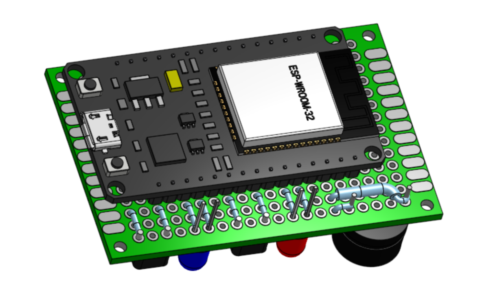

# Devlog 7
1h 31min 0sec Logged

I finished CADing the wires in the perfboard assembly! Again, since my 3D printer is broken, this is the last contribution I will be making to the Room Buzzer, at least for the time being. I'll wrap things up in my README so that you can make the Room Buzzer too! I hope you find the assembly useful in wiring (:

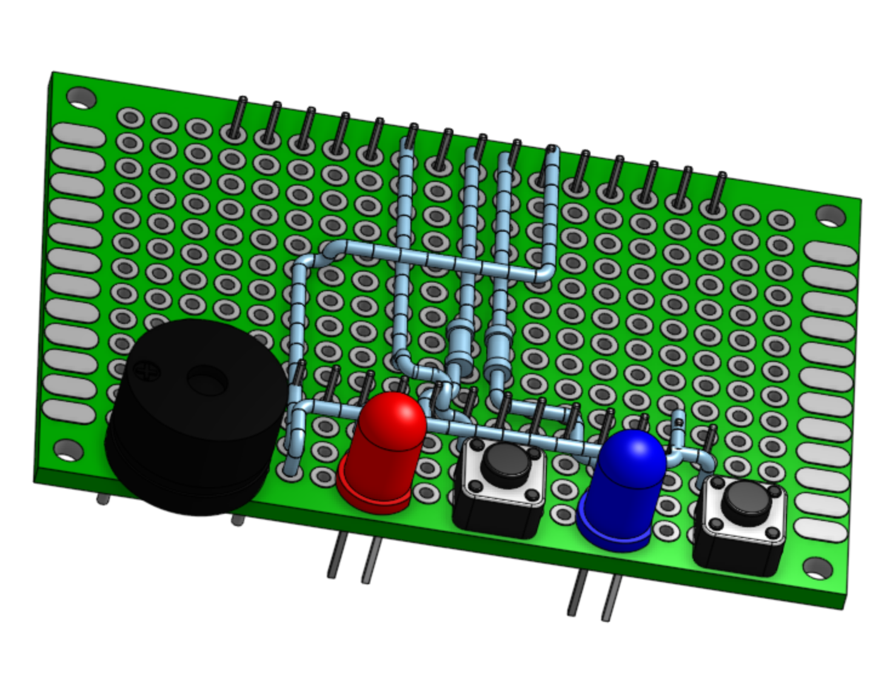
