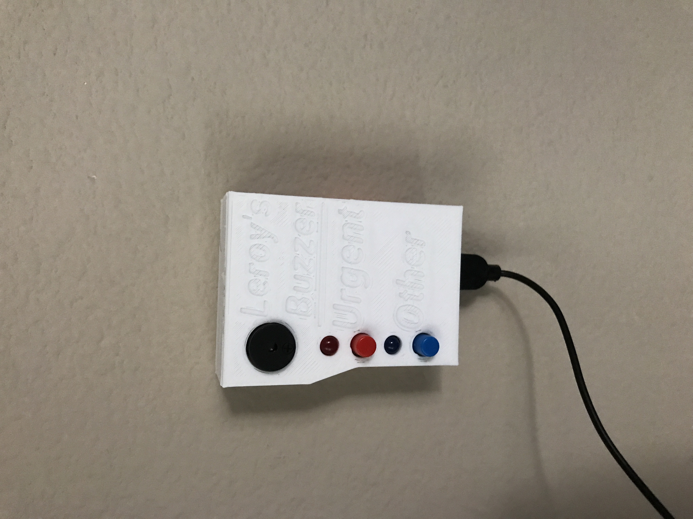
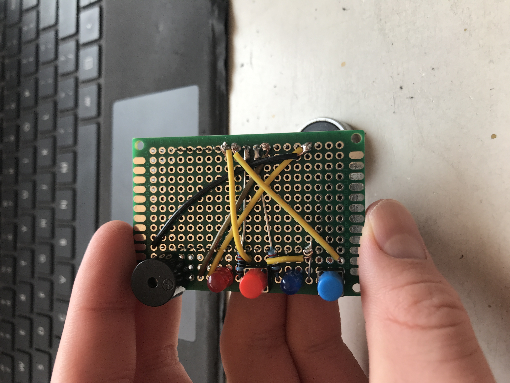
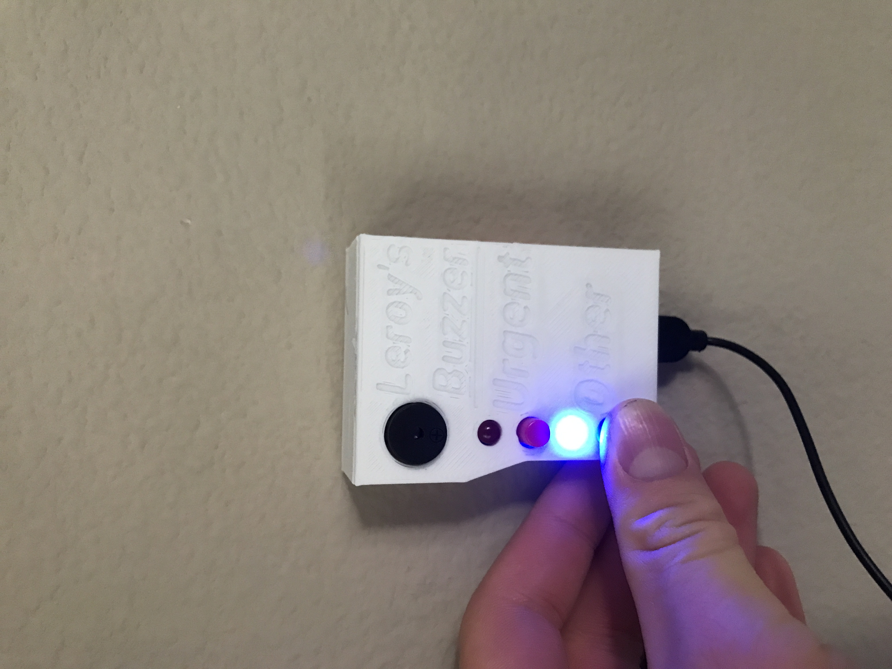
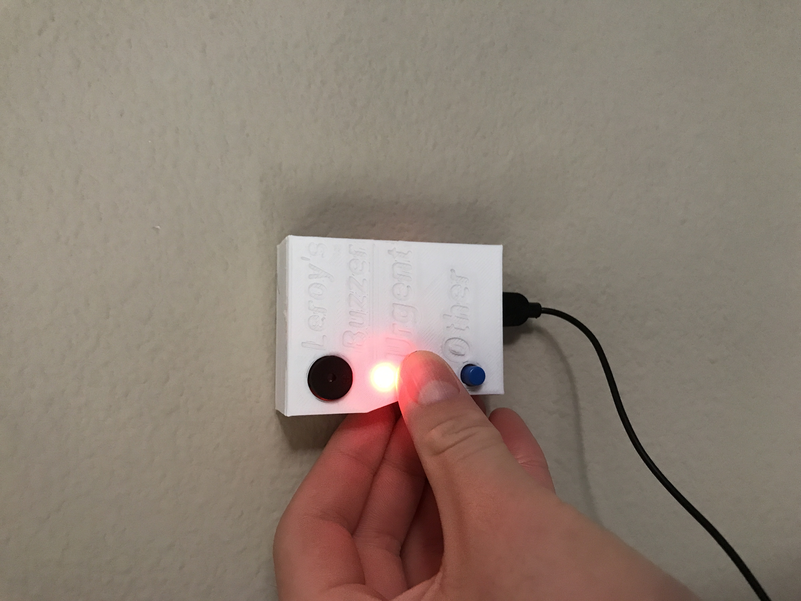
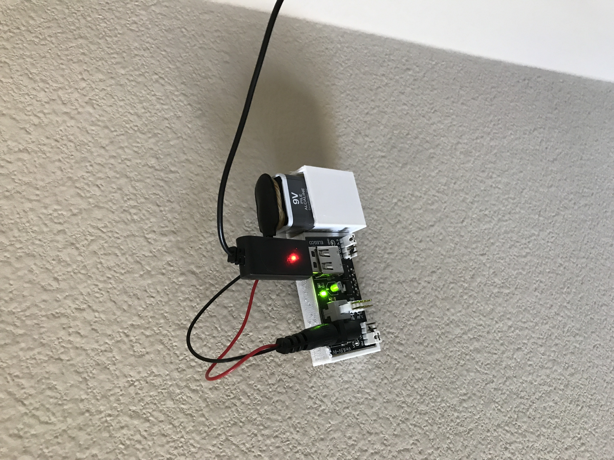

# Room_Buzzer
A buzzer for my room! (Mostly so that my little brother will get off my back about playing). The Room Buzzer is an ESP-32 powered device that you can put outside your room's door for your annoying siblings to ring when they want in. There are two buttons, so that they have an option between a "are you there?" and a "GET OUT HERE RIGHT NOW!!!!". There is a passive buzzer on the device for a satisfying buzz, and there are two LEDs to confirm the button presses. Due to the ESP-32's wireless capabilities, you may link the Room Buzzer with your laptop/computer to access the alerts. I plan on making a receiver module in the future, so that you can get notified without being on your computer. But introductions aside, here is everything there is to know about the Room Buzzer!

# Steps to Reproduce

If you're reading this, it either means that you want to build the Room Buzzer for yourself or you're the person reviewing my project! In that case, thank you very much for helping out in Hack Club, I'm a hardware reviewer myself (in Stardance) and I know that it's a pain when someone doesn't have all their stuff in order. Well, don't worry, I'm gonna do my job so you can do yours!

# BOM

The following is everything you will need to make the Room Buzzer:

- 6cm x 4cm perfboard: $0.30
- Passive Buzzer: $0.10
- Two 5mm LEDs (one blue, one red): $0.10
- Two Push Buttons (with caps, one blue, one red. They should be the two-pin variety): $0.10
- ESP32-WROOM: $2.50
- Elegoo Power MB V2: $2.00
- Power Micro-USB Cable: $2.00
- 9V Battery: $1.25
- 9V Battery Jack Cable: $0.15
- Two 220 ohm Resistors: $0.10
- 3D Printed Parts: NA
- Solder: NA
- 22/24 AWG Wire: NA

In total, the Room Buzzer will cost you around $8.60 before 3D printed parts, solder, wire, and taxes. All in all, pretty cheap!

# Assembly Instructoins

First, you'll want to get the perfboard all wired up. 

Side 1:

ESP-32 VIN: C14
ESP-32 D23: Q4

Side 2:

Passive Buzzer GND pin: A1
Passive Buzzer VCC pin: D1
Red LED GND pin: H1
Red LED VCC pin: I1
Red Button pin 1: K1
Red Button pin 2: M1
Blue LED VCC pin: O1
Blue LED GND pin: P1
Blue Button pin 1: R1
Blue Button pin 2: T1

GPIO Connections:

Red LED VCC: D25 (K14)  W/220 ohm RESISTOR
Blue LED VCC: D26 (L14)  W/220 ohm RESISTOR
Red Button (anypin): D32 (I14)
Blue Button (anypin): D33 (J14)
Passive Buzzer VCC: D27 (M14)

Of course, the unused legs of the buttons and the remaining pins shall go to either one of the ESP-32's GNDs. It should end up looking like this (on side 2):

# Instructions on Use

To use the Room Buzzer after assembly, first use Arduino IDE to flash the Main.ino file onto your ESP-32. Then, assuming you're on windows (boo-hoo to you if you're not), open up Windows Powershell and copy/paste the Windows_PowerShell_CodeV1.0.txt file's contents into the terminal. Make sure to press "Enter". After the program prints "Room Buzzer is running..." and "Waiting for notifications...", you may have at it with the transmitter module. The alerts will be pop-ups on your laptop. Personally, I put my power module in my room, ran the Micro-USB cable through the crease of the door, and have my Room Buzzer sitting outside. It's fun!

# Image Gallery

The Room Buzzer V1.0:
![An image of the completed Room Buzzer V1.0}(Images/IMG_0320.JPG)

The casual alert button being pressed:

The urgent alert button being pressed:

The power module:

# AI Use

AI was used to code the Windows Powershell code. I didn't want to learn how to code in Windows Powershell just for this, so I used AI lol (:
